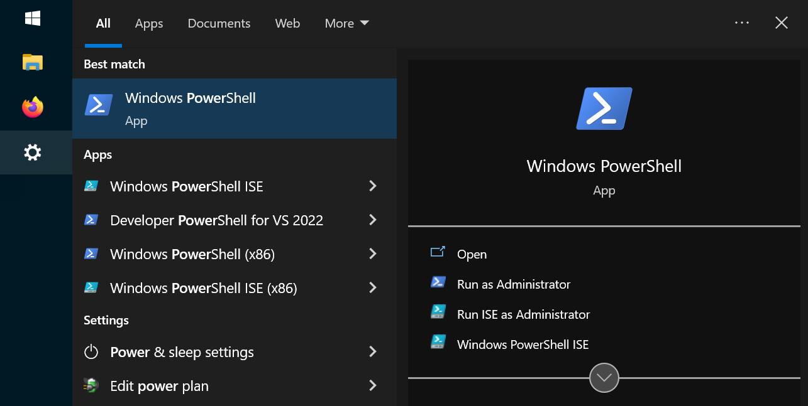
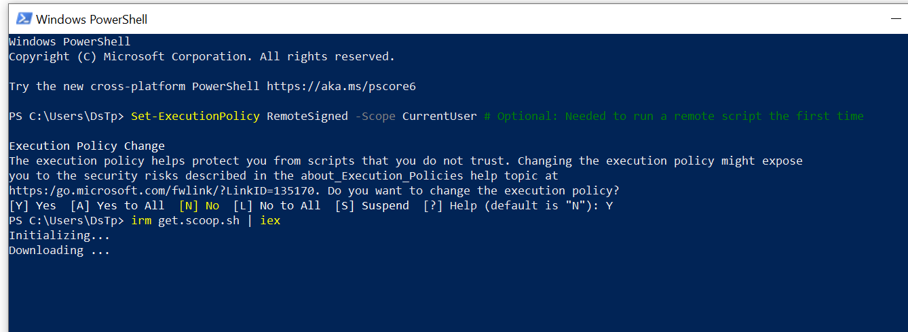
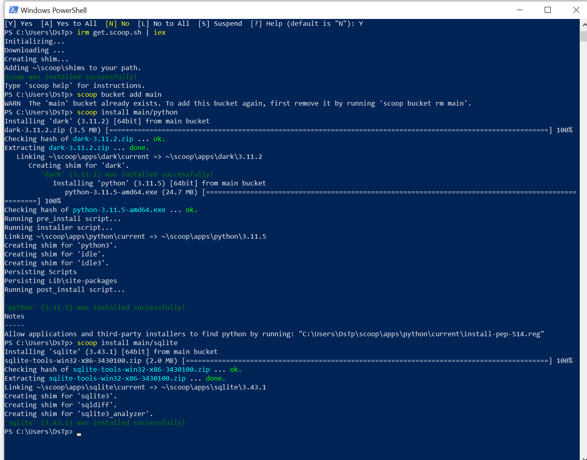

### Windows

En una ventana de PowerShell ejecutar:

```sh
Set-ExecutionPolicy RemoteSigned -Scope CurrentUser # Optional: Needed to run a remote script the first time
irm get.scoop.sh | iex

```





Final mente en la misma ventana ejecutar:

```sh
scoop install main/python
scoop install main/sqlite
scoop install main/git
```


