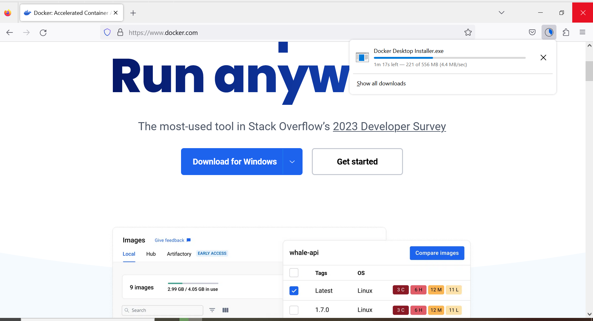
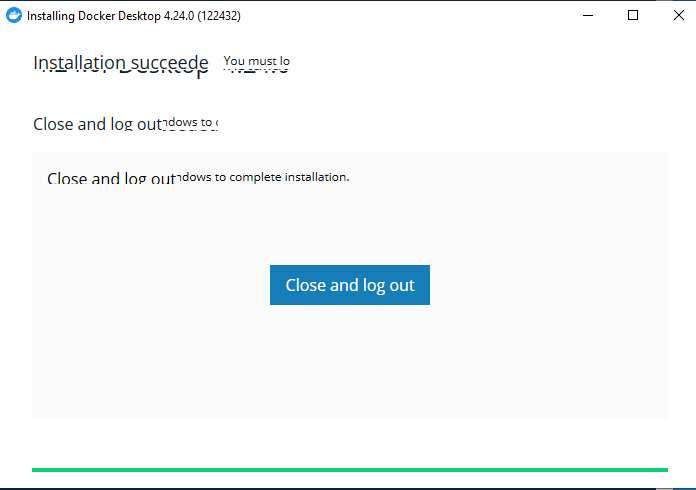
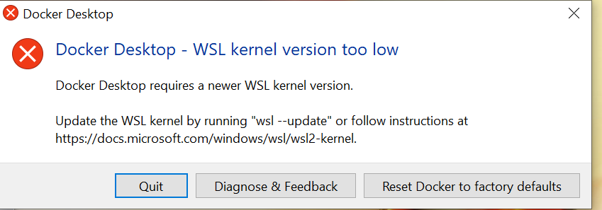

Cómo crear una aplicación Node.js y MongoDB con contenedores Docker
===================================================================

.. contents::
   Índice

Introducción a Docker

Docker es la plataforma de contenedores de software líder en el mundo.
Es una herramienta diseñada para facilitar la creación, implementación y
ejecución de la aplicación mediante el uso de contenedores. Docker facilita el
proceso de implementación de una aplicación y es eficiente al resolver muchos
problemas relacionados con la implementación.

¿Por qué contenedores?

Los contenedores resuelven el problema de que un código funcione en un sistema
operativo/entorno informático y no funcione en otro. Las razones por las que no
funciona pueden ser la falta de dependencias o actualizaciones retrasadas de
software o dependencia en todos los sistemas operativos.

En tal caso, una aplicación empaquetada dentro de un Docker Container puede
ejecutarse en cualquier sistema que tenga Docker instalado. Aquí, Docker sirve
como plataforma común, cada contenedor se construye en su propio sistema
operativo/binarios o bibliotecas que requiere la aplicación que se ejecuta en
su interior. De esta manera, un contenedor Docker no tiene nada que ver con el
hardware o el sistema operativo subyacente y puede ejecutarse en cualquier
entorno informático siempre que Docker esté instalado en él.

La siguiente imagen ilustra un caso de uso similar:

Beneficios de Docker:

:Portabilidad: Puede ejecutarse en cualquier plataforma como sistema local,
               Amazon EC2, plataformas en la nube de Google o virtual box.

:Control de versiones: Al ser texto plano se pueden usar todas las
                       características del sistema de gestión de versiones
:Función de aislamiento: no interactúa con ninguna otra aplicación que se
                         ejecute en el mismo sistema
:Seguridad: Al manejarse en entornos aislados del sistema anfitrión se gana
            seguridad por que el atacante solo podrá ver el nodo y no el
            anfitrión u otros nodos

Para obtener más información, visite: `Docker y Contenización frente a Virtualización <https://medium.freecodecamp.org/a-beginner-friendly-introduction-to-containers-vms-and-docker-79a9e3e119b>`_

Comprender la terminología Docker

.. code::

 Desarrollador
      |                                  pull image ↗︎  Imagen Docker
      v                                            ╱     ↓
 Dockerfile  ====> Imagen Docker ====> Docker Hub <   Contenedor Docker
                         |                         ╲
                         v                          ↘ Imagen Docker
                  Contenedor Docker                         ↓
                                                     Contenedor Docker
Instalar Docker en Windows
--------------------------

Descargar de `docker.com <https://docker.com>`_

Permitir hacer cambios para instalar Docker

.. image:: ../Imgs/PermitirHacerCambiosEnSuDispositivo.png

Instalando...

Reiniciar

.. image:: ../Imgs/ReinicarLuegoDeInstalarDocker.png

.. image:: ../Imgs/SuscripDocker.png

en caso de error es necesario instalar `Subsistema de Linux para Windows WSL
<https://es.wikipedia.org/wiki/Subsistema_de_Windows_para_Linux>`_

.. code::

 wsl --install
 wsl --update

.. image:: ../Imgs/ActualizarWSL2.png

Dockerfile
----------

Un Dockerfile es un documento de texto que contiene todos los comandos (conjunto
de instrucciones) que se ejecutan para crear una imagen.

.. code::

 FROM alpine:latest
 RUN apk add — no-cache nodejs npm
 WORKDIR /app
 COPY . /app
 COPY package.json /app
 RUN npm install
 COPY . /app
 EXPOSE 8080
 CMD [“node”, “app.js”]

:FROM: Crea capas de dependencias como si pudiéramos construir una capa de
       sistema operativo.
:RUN: nos permite instalar su aplicación y los paquetes necesarios para ella.
:COPY: agrega archivos del directorio actual del cliente Docker.
:EXPOSE: informa a Docker que el contenedor escucha en el puerto de red
         especificado en tiempo de ejecución.
:CMD: especifica qué comando ejecutar dentro del contenedor.

.. note:: la diferencia entre RUN y CMD es:

    :RUN: se ejecutará mientras se crea la imagen.
    :CMD: es una lista de cosas para ejecutar dentro de un contenedor creado a
          partir de una imagen.

Imagen Docker
----------------

Una imagen es una combinación de un sistema de archivos y parámetros. Las
imágenes de Docker se parecen más a plantillas utilizadas para crear un
contenedor de Docker. El comando ejecutar se usa para mencionar que queremos
crear una instancia de una imagen, que luego se llama contenedor .

Contenedor Docker
--------------------

Un contenedor permite a un desarrollador empaquetar una aplicación con todas sus
bibliotecas y otras dependencias en una única unidad estandarizada, de modo que
la aplicación pueda ejecutarse de forma rápida y confiable de un entorno
informático a otro.

Cada contenedor (una instancia de una imagen de Docker) incluye los siguientes componentes:

- Una selección de sistema operativo, por ejemplo, una distribución de Linux,
  Windows Nano Server o Windows Server Core.
- Archivos agregados durante el desarrollo, por ejemplo, código fuente y
  binarios de aplicaciones.
- Información de configuración, como la configuración del entorno y las
  dependencias.

Docker Hub
----------------

Docker Hub es un repositorio basado en la nube en el que los usuarios y socios
pueden crear, probar, almacenar y distribuir imágenes de contenedores. A través
de Docker Hub, un usuario puede acceder a repositorios de imágenes públicos y
oficiales, así como crear sus propios repositorios privados, funciones de
compilación automatizadas, webhooks y grupos de trabajo.

Caso de Estudio
---------------

Integración de la aplicación Node.js + MongoDB con Docker

Veamos cómo integrar una aplicación Node.js con contenedores Docker. Para este
tutorial, he creado una aplicación de inicio de sesión de muestra utilizando
MongoDB. Archivos fuente: `Simple Node.js / Express.js / MongoDB / Docker Proof-of-concept <https://github.com/jennaknudsen/simple-nodejs-mongodb-docker-app.git>`_

Pasos involucrados:

#. Configure su aplicación Nodejs.
#. Cree Dockerfile para cada servicio.
#. Defina servicios utilizando el archivo Compose.
#. Ejecute docker-compose para compilar la aplicación.

Paso 1
------

Configurar una aplicación Nodejs.

Creé una aplicación de inicio de sesión de muestra usando Nodejs y MongoDB. Lo ejecutaré localmente y comprobaré si funciona correctamente. Nuestra aplicación tiene 2 servicios en ejecución, iniciemos ambos.

Iniciar node

.. code::

 git clone https://github.com/jennaknudsen/simple-nodejs-mongodb-docker-app.git
 cd simple-nodejs-mongodb-docker-app

Ahora dockericemos esta aplicación.

Paso 2
------

Cree Dockerfile para cada servicio

- Se puede crear un Dockerfile en el mismo directorio del proyecto o fuera del
  directorio del proyecto (se debe proporcionar la ruta a los archivos fuente).
- Crearé el archivo Docker en el directorio del proyecto.
- Crear un Dockerfile es tan fácil como crear un archivo nuevo. Asigne a este
  archivo el nombre que desee, pero la práctica estándar es llamarlo Dockerfile.
- Con su editor de texto preferido, puede agregar algunas instrucciones en ese archivo.

**Al ejecutar un archivo acoplable se crea una imagen. Una imagen se compone de varias capas y cada instrucción en un Dockerfile agrega una capa a la imagen.**

- Las capas de una imagen constan de archivos de aplicación y sus dependencias.

Necesitamos 2 servicios para que se ejecute nuestra aplicación, por lo que
necesitamos 2 imágenes para nuestra aplicación, una para la aplicación de inicio
de sesión y otra para MongoDB.

Imagen de la aplicación de inicio de sesión de Dockerfile:

.. code::

 # Cada instrucción en este archivo crea una nueva capa
 # Aquí obtenemos nuestro nodo como imagen base
 FROM node:latest
 # Creando un nuevo directorio para los archivos de la aplicación y configurando
 # la ruta en el contenedor
 RUN mkdir -p /usr/src/app
 # configuración directorio de trabajo en el contenedor
 WORKDIR /usr/src/app
 # copiar el archivo package.json (contiene dependencias) del directorio de origen del proyecto al directorio del contenedor
 COPY package.json /usr/src/app
 # instalar las dependencias en el contenedor
 RUN npm install
 # copiar el código fuente de la aplicación en el directorio contenedor
 COPY . /usr/src/app
 # contenedor expuesto número de puerto de red
 EXPOSE 3000
 #comando para ejecutar dentro del contenedor
 CMD ['node', 'app.js']

Construyendo y probando Dockerfile:

- Para crear una imagen de Docker desde Dockerfile, use el comando:

.. code::

 docker build -t <nombre_para_imagen>.

- -t representa el nombre de la etiqueta
- . representa el directorio actual

Ejecute el comando anterior en el directorio del proyecto donde está almacenado
el archivo Dockerfile.

Para esta demostración, nombré mi imagen como Latest123/simple-nodejs-mongodb-docker-app. Asigne un
nombre a su imagen según sus requisitos, ya que se utiliza para realizar todas
las operaciones.

.. code::

 docker build -t latest123/simple-nodejs-mongodb-docker-app .

- Para enumerar las imágenes creadas, use el comando:

.. code::

 docker images

Si lo ha notado, tenemos 2 imágenes creadas, una es la imagen de nuestra
aplicación de inicio de sesión y la otra es la imagen oficial del nodo extraída
de Docker Hub. Entonces, la imagen de nuestra aplicación de inicio de sesión
está construida sobre la imagen oficial del nodo.

Las imágenes son como clases y los contenedores son como objetos. Un contenedor
es una instancia en ejecución de una imagen. Nuestros servicios se ejecutan
dentro de estos contenedores.

Ejecute la imagen para obtener el contenedor:

Para ejecutar esa imagen use:

.. code::

 sudo docker run -d -p <puerto navegador>:<puerto de aplicación> <id_imagen/nombre>

    - -d(daemon) — ejecuta el código en segundo plano
    - p representa el número de red del puerto

Listar los contenedores en ejecución

.. code::

  docker ps

Ahora para monitorear los comandos de uso del contenedor:

#Para enumerar los contenedores en ejecución
sudo docker ps#Para enumerar todos los contenedores disponibles
sudo docker ps -a#Para iniciar un contenedor detenido
sudo docker start <nombre_contenedor/ID>#Para detener un contenedor en ejecución
sudo docker stop <nombre_contenedor/ID>

No creé una imagen de Mongo porque usaré la imagen oficial de Mongo de Docker
Hub en el archivo de Docker Compose.

Paso 3
-------

Definir servicios usando el archivo docker-compose.yml

Docker Compose es una herramienta para definir y ejecutar aplicaciones Docker de
múltiples contenedores. Con Compose, se utiliza un archivo YAML para configurar
los servicios de su aplicación. Luego, con un solo comando, creas e inicias\
todos los servicios/contenedores desde tu ambiente local.

Creando docker-compose.yml

Ahora creemos un archivo docker-compose.yml en el mismo directorio. Definiremos
nuestros servicios/contenedores dentro de este archivo. Al crear un archivo
Docker-Compose, la extensión .yml es imprescindible.

docker-compose.yml

.. code::

 version: "3"
 services:
        mongo-container:
              container_name: mongo-container
              image: mongo:4.2
              volumes:
                - ./data:/data/db
              ports:
                - '27018:27017'
        simple-nodejs-mongodb-docker-app:
            container_name: simple-nodejs-mongodb-docker-app
            image: latest123/simple-nodejs-mongodb-docker-app
            restart: always
            build: .
            ports:
              - "3000:3000"
            links:
              - mongo-container

Desglosando el código anterior:

- Este archivo define dos servicios: **simple-nodejs-mongodb-docker-app** y **mongo-container**
- El campo **container_name** se utiliza para nombrar el contenedor creado.
- El campo **build** especifica la ruta al archivo dockerfile para crear la
  imagen, en este caso llamé simple-nodejs-mongodb-docker-app. De esta manera,
  nombrar un contenedor correctamente hace que sea más fácil trabajar con él y
  puede evitar nombres de contenedor generados aleatoriamente (esto es
  simplemente una preferencia personal, el nombre del servicio y los
  contenedores no tienen que ser iguales).
- El campo de compilación es donde especificamos la ruta al dockerfile para
  crear la imagen.
- Estoy creando la imagen de la aplicación de inicio de sesión usando el
  Dockerfile en el directorio del proyecto y asignando el puerto del
  host/navegador al puerto del contenedor/servicio/aplicación.
- Puede crear la imagen ejecutando `docker build` y luego especificar el nombre
  de la imagen en dockerfile o proporcionar directamente la ruta del dockerfile
  en redacción mediante el comando de compilación. Cuando especifica ambos,
  utiliza el comando de compilación.
- Nuestro segundo servicio es MongoDB , pero esta vez en lugar de crear nuestra
  propia imagen de Mongo , simplemente extraemos la imagen de Mongo estándar del
  registro de Docker Hub. Como aprendimos anteriormente, si una imagen no está
  disponible localmente, el demonio docker intentará extraerla de Docker Hub.
- Como la información en una Base de Datos no es volátil, necesitamos almacenamiento persistente. Entonces, montamos el directorio del host externo /data (aquí es donde agregué algunos datos iniciales a mi base de datos cuando ejecuté la aplicación localmente) en el directorio del contenedor /data/db .
- Los contenedores no tienen estado, lo que significa que cuando un contenedor finaliza, todos sus datos desaparecen. Montar volúmenes nos brinda almacenamiento persistente, por lo que al iniciar reiniciamos un contenedor, Docker Compose usará este almacenamiento persistente donde se almacenan todos los datos de los contenedores anteriores y lo copiará en el nuevo contenedor, asegurándose de que no se pierda ningún dato.
- Finalmente, usamos el comando links para vincular ambos servicios.

De esta manera, se puede acceder al servicio MongoDB desde el servicio de la aplicación de inicio de sesión .

Ejecutaremos este archivo docker-compose.yml usando el comando

.. code::

 docker-compose build
 docker-compose up

que activará dos contenedores con nuestros servicios ejecutándose dentro de
ellos y expondrá los servicios en números de puerto determinados.

Paso 4
------

Ejecute docker-compose para crear la aplicación

    Desde el directorio del proyecto, inicie su aplicación ejecutando

Docker-componer

Entonces deberías ver este resultado confirmando que tus servicios han sido creados:

Nuestra aplicación debería estar ejecutándose en http://localhost:3000/

    En esta etapa, cambie a otra ventana de terminal, use este comando para enumerar todas las imágenes locales

imagen sudo docker ls

    Y los contenedores en ejecución después de la composición se verán así:

    Podemos inspeccionar imágenes y contenedores usando:

inspeccionar imágenes:Docker inspecciona <etiqueta o id>inspeccionar el contenedor en ejecución:Docker inspecciona <ID-contenedor/nombre>

Detenga los contenedores de aplicaciones:

Ya sea ejecutando docker-compose down en la segunda terminal en el directorio del proyecto o presionando CTRL+C en la terminal original donde inició la aplicación.

Se verá así cuando usemos Ctrl+c.

    Si desea volver a ejecutar la aplicación, ejecute el comando

.. code::

 docker-compose up

