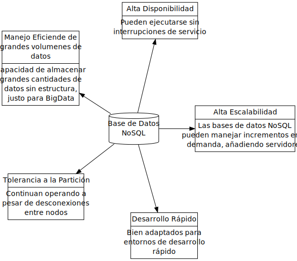

====================
Bases de datos NoSQL
====================

.. contents::

todo científico de datos necesita saber
=======================================

Descubra para qué se utilizan las bases de datos NoSQL, por qué las utilizan los científicos de datos y una lista de las mejores bases de datos NoSQL disponibles.

Exploramos una descripción general completa de los entresijos de las bases de datos NoSQL para científicos de datos.

Ciencia de datos y bases de datos NoSQL
---------------------------------------

Ser científico de datos no se trata solo de crear modelos de aprendizaje automático, sino también de poder procesar, analizar y comunicar mejor los resultados a partir de datos en diferentes formatos.

Las bases de datos SQL tradicionales se han utilizado como único tipo de base de datos durante años. Sin embargo, debido a la extrema popularidad de Internet a mediados de la década de 1990 y a la transformación digital, un nuevo tipo de datos se hizo prominente: las bases de datos NoSQL. Se introdujeron en respuesta a la debilidad de las bases de datos SQL tradicionales.

Las bases de datos NoSQL pueden ser utilizadas, por ejemplo, por científicos de datos e ingenieros de aprendizaje automático para almacenar datos, meta-datos de modelos, características y parámetros de operaciones. Por otro lado, los ingenieros de datos pueden aprovecharlos para almacenar y recuperar datos limpios.

En este blog conceptual (no se requiere codificación), primero desarrollaremos su comprensión de las bases de datos NoSQL antes de explorar la importancia de NoSQL. También compararemos bases de datos SQL y NoSQL y veremos los usos y categorías de estas últimas. Finalmente, examinaremos las bases de datos NoSQL más populares para científicos de datos.

¿Qué son las bases de datos NoSQL?
----------------------------------

NoSQL significa Not Only SQL, lo que significa que las bases de datos NoSQL tienen la especificidad de no ser relacionales porque pueden almacenar datos en un formato no estructurado. El siguiente gráfico destaca las cinco características críticas principales de las bases de datos NoSQL.

  Bases de datos NoSQL explicadas

¿Por qué son importantes las bases de datos NoSQL?
--------------------------------------------------

Las bases de datos NoSQL se han vuelto populares en la industria debido a los siguientes beneficios:

- Datos multi-modo: las bases de datos NoSQL ofrecen más flexibilidad que las bases de datos SQL tradicionales porque pueden almacenar datos estructurados (por ejemplo, datos capturados por sensores), no estructurados (imágenes, vídeos, etc.) y semi-estructurados (`XML`_, `JSON`_, etc.).

- Fácil escalabilidad: esto se simplifica gracias a sus arquitecturas peer-to-peer, lo que significa que se pueden agregar varias máquinas a la arquitectura.

- Disponibilidad global: permite acceder a los mismos datos simultáneamente a través de diferentes máquinas de diferentes zonas geográficas porque la base de datos se comparte globalmente.

- Flexibilidad: las bases de datos NoSQL pueden adaptarse rápidamente a los requisitos cambiantes con actualizaciones frecuentes y nuevas funciones.

Bases de datos NoSQL frente a BBDD SQL
--------------------------------------

+----------------+------------------------------------+-------------------------------------------+
|                |        Bases de datos SQL          |         Bases de datos NoSQL              |
+================+====================================+===========================================+
|Lenguaje        |Las bases de datos SQL utilizan     |Por otro lado, las bases de datos NoSQL    |
|                |lenguajes de consulta estructurados |utilizan un esquema dinámico para consultar|
|                |para realizar operaciones, lo que   |datos. Además, algunas bases de datos NoSQL|
|                |requiere un esquema predefinido     |utilizan una sintaxis similar a SQL para la|
|                |para interactuar mejor con los datos|manipulación de documentos                 |
+----------------+------------------------------------+-------------------------------------------+
|Esquema de datos|Las bases de datos SQL tienen un    |Las bases de datos NoSQL son más flexibles.|
|                |formato predefinido y fijo, que     |Esta flexibilidad significa que se pueden  |
|                |no se puede cambiar para datos      |crear registros en las bases de datos sin  |
|                |nuevos                              |tener una estructura predefinida, y cada   |
|                |                                    |registro tiene su propia estructura        |
+----------------+------------------------------------+-------------------------------------------+
|Escalabilidad   |Las bases de datos SQL solo son     |Las bases de datos NoSQL son escalables    |
|                |escalables verticalmente, lo que    |horizontalmente, lo que significa que      |
|                |significa que una sola máquina      |se agregan máquinas adicionales a la       |
|                |necesita aumentar la CPU, la RAM    |infraestructura existente para             |
|                |y el SSD hasta un cierto nivel      |satisfacer la demanda de almacenamiento    |
|                |para satisfacer la demanda          |                                           |
+----------------+------------------------------------+-------------------------------------------+
|BigData         |El escalado vertical dificulta      |El escalado horizontal y el esquema de     |
|                |que las bases de datos SQL          |datos dinámicos hacen que NoSQL sea        |
|                |almacenen datos muy grandes         |adecuado para big data. Además, las        |
|                |[petabytes]                         |principales empresas de Internet (Amazon,  |
|                |                                    |Google, Yahoo, etc.) desarrollaron         |
|                |                                    |bases de datos NoSQL para afrontar los     |
|                |                                    |desafíos del rápido aumento de la cantidad |
|                |                                    |de datos                                   |
+----------------+------------------------------------+-------------------------------------------+
|Propiedades     |Las bases de datos SQL utilizan     |Por otro lado, las bases de datos          |
|                |la propiedad `ACID`_                |NoSQL utilizan la propiedad CAP            |
|                |(Atomicidad, Consistencia,          |(Consistencia, Disponibilidad,             |
|                |Aislamiento, Durabilidad)           |Tolerancia de Partición)                   |
+----------------+------------------------------------+-------------------------------------------+

¿Cuándo se deben utilizar las bases de datos NoSQL?
---------------------------------------------------

En este entorno competitivo y de rápido crecimiento, las industrias necesitan recopilar la mayor cantidad de datos posible para satisfacer sus objetivos comerciales. Recopilar datos es una cosa, pero almacenarlos en la infraestructura adecuada es otro desafío. La dificultad surge porque los datos pueden ser de diferentes tipos, como imágenes, vídeos, texto y sonidos. Usar bases de datos relacionales para almacenar estos diferentes tipos de datos no siempre es una decisión inteligente. Sin embargo, la pregunta sigue siendo:

**¿Cuándo utilizar NoSQL en lugar de SQL?**

Debería considerar el uso de NoSQL cuando se encuentre en el siguiente escenario:

- Cambio constante de datos: cuando no sabes cómo crecerá tu sistema o tus aplicaciones en el futuro, lo que significa que quizás quieras agregar nuevos tipos de datos, nuevas funciones, etc.

- Muchos datos: cuando su empresa maneja una gran cantidad de datos que pueden crecer con el tiempo.

- Sin coherencia: cuando la coherencia de los datos y el 100% de integridad no son su prioridad. Por ejemplo, cuando desarrollas una plataforma de redes sociales para tu empresa, es posible que todos los empleados que vean tus publicaciones a la vez no sean un problema.

- Escalabilidad y costo: las bases de datos NoSQL permiten una mayor flexibilidad y pueden controlar los costos a medida que cambian sus necesidades de datos.

4 tipos principales de bases de datos NoSQL
-------------------------------------------

Las bases de datos NoSQL se dividen en cuatro categorías principales. Cada uno tiene su especificidad, por lo que debes elegir el que mejor se adapte a tu caso de uso: A continuación, destacamos los principales ejemplos de bases de datos NoSQL. Esta sección tiene como objetivo cubrir cada una de estas bases de datos proporcionando su función y una lista no exhaustiva de sus ventajas y limitaciones, y sus casos de uso.

Categorías de bases de datos NoSQL

1. Bases de datos de documentos
^^^^^^^^^^^^^^^^^^^^^^^^^^^^^^^

Este tipo de base de datos está diseñada para almacenar y consultar documentos `JSON`_, `XML`_, `BSON`_, etc. Cada documento es una fila o un registro en la base de datos y está en formato clave-valor. Un documento almacena información sobre un objeto y sus datos relacionados. Por ejemplo, la siguiente base de datos contiene tres registros, cada uno brinda información sobre un estudiante. Para el primer documento, el nombre es una clave y Franck es su valor.

Ventajas de la base de datos de documentos
++++++++++++++++++++++++++++++++++++++++++

- Sin estructura: no existen limitaciones en cuanto al formato y estructura del almacenamiento de datos. Esto es beneficioso, especialmente cuando hay una transformación continua en la base de datos.

- Fácil de actualizar: se puede agregar o eliminar una información nueva sin cambiar el resto de los campos existentes de ese documento específico.

- Rendimiento mejorado: toda la información de un documento se puede encontrar exactamente en ese mismo documento. No es necesario hacer referencia a información externa, lo que podría no ser el caso de una base de datos relacional donde el usuario podría tener que solicitar otras tablas.

Limitaciones de la base de datos de documentos
++++++++++++++++++++++++++++++++++++++++++++++

- Problemas de verificación de coherencia: porque los documentos no necesariamente tienen que tener una relación entre sí y dos documentos pueden tener campos diferentes.

- Problemas de atomicidad: si tenemos que cambiar dos colecciones de documentos, necesitaremos ejecutar una consulta separada para cada documento.

Cuándo utilizar bases de datos de documentos
++++++++++++++++++++++++++++++++++++++++++++

- Recomendado cuando su esquema de datos está sujeto a cambios constantes en el futuro.

Aplicaciones de bases de datos de documentos
++++++++++++++++++++++++++++++++++++++++++++

- Debido a su flexibilidad, las bases de datos de documentos pueden resultar prácticas para perfiles de usuarios en línea, donde diferentes usuarios pueden tener diferentes tipos de información. En este caso, el perfil de cada usuario se almacena únicamente mediante el uso de atributos que le son específicos.

- Se pueden utilizar para la gestión de contenidos, lo que requiere un almacenamiento eficaz de datos de una variedad de fuentes. Luego, esa información se puede utilizar para crear e incorporar nuevos tipos de contenido.

2. ​​Bases de datos clave-valor
^^^^^^^^^^^^^^^^^^^^^^^^^^^^^^^

Estos son los tipos más simples de bases de datos NoSQL. Cada elemento se almacena en la base de datos en un par clave-valor. Podemos considerarlo como una tabla con exactamente dos columnas. La primera columna contiene una clave única. La segunda columna es el valor de cada clave. Los valores pueden estar en diferentes tipos de datos, como enteros, cadenas y flotantes, o tipos de datos más complejos, como imágenes y documentos.

El siguiente ejemplo ilustra una base de datos clave-valor que contiene información sobre los clientes donde la clave es su número de teléfono y el valor es su compra mensual.

Ejemplo de base de datos NoSQL clave/valor

Ventajas de la base de datos de clave-valor
+++++++++++++++++++++++++++++++++++++++++++++

- Simplicidad: la estructura clave-valor es sencilla. La ausencia de tipo de datos hace que su uso sea sencillo.
- Velocidad: el formato de datos simple hace que las operaciones de lectura y escritura sean más rápidas.

Limitaciones de la base de datos de clave-valor
+++++++++++++++++++++++++++++++++++++++++++++++++

- No pueden realizar ningún filtrado en la columna de valor porque el valor devuelto es toda la información almacenada en el campo de valor.

- Se optimiza únicamente al tener una única clave y valor. Almacenar múltiples valores requeriría un analizador.

- El valor se actualiza solo en su totalidad, lo que requiere obtener los datos completos, realizar el procesamiento requerido en esos datos y, finalmente, almacenar nuevamente todos los datos. Esto podría crear un problema de rendimiento cuando el procesamiento requiere mucho tiempo.

Cuándo utilizar bases de datos clave-valor
++++++++++++++++++++++++++++++++++++++++++

- Adaptado para aplicaciones basadas en consultas simples basadas en claves.
- Se utiliza para aplicaciones simples que necesitan almacenar temporalmente objetos simples como el caché.
- También se pueden utilizar cuando sea necesario acceder a datos en tiempo real.

Aplicaciones
+++++++++++++

- Son mejores para aplicaciones simples que necesitan almacenar temporalmente objetos simples como el caché.

3. Bases de datos de columnas anchas
^^^^^^^^^^^^^^^^^^^^^^^^^^^^^^^^^^^^

Como sugiere el nombre, las bases de datos orientadas a columnas se utilizan para almacenar datos como una colección de columnas, donde cada columna se trata por separado y la lógica de implementación se basa en el documento de Google Big Table. Se utilizan principalmente para cargas de trabajo analíticas, como inteligencia empresarial, gestión de almacenes de datos y gestión de relaciones con los clientes.

Por ejemplo, podemos obtener rápidamente la edad promedio y el precio promedio respectivamente de clientes y productos con la función de agregación AVG en cada columna.

Ejemplo NoSQL de base de datos de columna ancha

Ventajas de la base de datos de columnas anchas
+++++++++++++++++++++++++++++++++++++++++++++++

- Cercanía con las Bases de Datos Relacionales
- Velocidad con operaciones de agregación(media, mínimo, máximo, etc.)

Limitaciones de la base de datos de columnas anchas
+++++++++++++++++++++++++++++++++++++++++++++++++++

- Útil con casos poco relacionados o no jerárquicos

Aplicaciones
+++++++++++++

- Reemplazar datos relativamente simples (Pocas columnas) donde se deben hacer operaciones simples sobre el conjunto de datos

4. Bases de datos de grafos/nodos
^^^^^^^^^^^^^^^^^^^^^^^^^^^^^^^^^^

Las bases de datos de grafos se utilizan para almacenar, mapear y buscar relaciones entre nodos a través de aristas. Un nodo representa un elemento de datos, también llamado objeto o entidad. Cada nodo tiene una arista entrante o saliente. Una arista representa la relación entre dos nodos. Estas aristas contienen algunas propiedades correspondientes a los nodos que conectan.

“Zoumana estudia en la Universidad Tecnológica de Texas. Le gusta correr en el parque dentro de la Universidad”

Ejemplo de NoSQL de base de datos de grafo/nodo

Ventajas de la base de datos de grafos/nodos
++++++++++++++++++++++++++++++++++++++++++++

- Son una estructura ágil y flexible.
- La relación entre los nodos de la base de datos es legible y explícita, por lo que es fácil de entender.

Limitaciones de la base de datos de grafos/nodos
++++++++++++++++++++++++++++++++++++++++++++++++

- No existe un lenguaje de consulta estandarizado porque cada idioma depende de la plataforma.
- La razón anterior hace que sea difícil encontrar soporte en línea cuando se enfrenta un problema.

Cuándo utilizar bases de datos de grafos/nodos
++++++++++++++++++++++++++++++++++++++++++++++

- Se pueden utilizar cuando necesite crear relaciones entre elementos de datos y poder recuperar esas relaciones rápidamente.

Aplicaciones
++++++++++++

- Se pueden utilizar para realizar una sofisticada detección de fraude en transacciones financieras en tiempo real.
- Se pueden utilizar para extraer datos de las redes sociales. Por ejemplo, LinkedIn utiliza una base de datos gráfica para identificar qué usuarios se siguen entre sí y la relación entre esos usuarios y su experiencia (ingeniero de ML).
- El mapeo de redes puede ser una excelente opción para la representación como un gráfico, ya que esas redes mapean las relaciones entre el hardware y los servicios que admiten.

7 bases de datos NoSQL para ciencia de datos
--------------------------------------------

Ahora que tiene un mejor conocimiento de las bases de datos NoSQL, veamos una lista de bases de datos NoSQL que son populares para proyectos de ciencia de datos. Este análisis sólo se centra en bases de datos NoSQL de código abierto.

Bases de datos NoSQL más populares

1. `MongoDB`_
^^^^^^^^^^^^^^

`MongoDB`_ es una base de datos de código abierto orientada a documentos que almacena datos en formato JSON. Es la base de datos más utilizada y fue diseñada para ofrecer alta disponibilidad y escalabilidad, proporcionando uso compartido automático y replicación integrada. Nuestro curso de Introducción a MongoDB cubre el uso de MongoDB y Python. Ayuda a adquirir las habilidades para manipular y analizar datos estructurados de forma flexible con MongoDB. Uber, LaunchDarkl, Delivery Hero y 4300 empresas utilizan MongoDB en su pila tecnológica.

2. `Cassandra`_
^^^^^^^^^^^^^^^

`Cassandra`_ también es una base de datos de columnas grandes de código abierto. Puede distribuir sus datos entre varias máquinas y reparticionarlos automáticamente a medida que agrega nuevas máquinas a su infraestructura. Uber, Facebook, Netflix y otras 506 empresas lo utilizan en su paquete tecnológico.

3. `Elasticsearch`_
^^^^^^^^^^^^^^^^^^^

Al igual que MongoDB, `Elasticsearch`_ también es una base de datos orientada a documentos y de código abierto. Es una herramienta de búsqueda y análisis líder en el mundo que se centra en la escalabilidad y la velocidad. Uber, Shopify, Udemy y alrededor de 3760 empresas más lo utilizan en su pila.

4. `Neo4J`_
^^^^^^^^^^^^^^^^

`Neo4J`_ es una base de datos de código abierto orientada a gráficos. Se utiliza principalmente para tratar datos crecientes con relaciones. Según se informa, alrededor de 220 empresas lo utilizan en su pila tecnológica.

5. `HBase`_
^^^^^^^^^^^

Esta es una base de datos distribuida y orientada a columnas. También proporciona las mismas capacidades que `BigTable`_ de Google además de Apache Hadoop. Según se informa, 81 empresas utilizan HBase en su pila tecnológica.

6. `CouchDB`_
^^^^^^^^^^^^^^^

`CouchDB`_ también es una base de datos de código abierto orientada a documentos que recopila y almacena datos en formato `JSON`_. Alrededor de 84 empresas lo utilizan en su pila tecnológica.

7. `OrientDB`_
^^^^^^^^^^^^^^^^

`OrientDB`_, que también es una base de datos de código abierto, es una base de datos multi-modelo que admite modelos de gráficos, documentos, clave-valor y objetos. Según se informa, sólo 13 empresas lo utilizan en su pila tecnológica.

Conclusión
==========

Este articulo ha cubierto los aspectos principales de las bases de datos NoSQL y cómo pueden ser beneficiosas para sus proyectos de ciencia de datos en los entornos de rápido crecimiento actuales. Tiene algunas de las herramientas a su disposición para elegir e implementar la base de datos adecuada para su caso de uso.

.. _MongoDB: https://es.wikipedia.org/wiki/MongoDB
.. _Cassandra: https://es.wikipedia.org/wiki/Apache_Cassandra
.. _Elasticsearch: https://es.wikipedia.org/wiki/Elasticsearch
.. _Neo4J: https://es.wikipedia.org/wiki/Neo4j
.. _HBase: https://es.wikipedia.org/wiki/Apache_HBase
.. _CouchDB: https://es.wikipedia.org/wiki/CouchDB
.. _BigTable: https://es.wikipedia.org/wiki/BigTable
.. _OrientDB: https://en.wikipedia.org/wiki/OrientDB
.. _JSON: https://es.wikipedia.org/wiki/JSON
.. _BSON: https://es.wikipedia.org/wiki/BSON
.. _ACID: https://es.wikipedia.org/wiki/ACID
.. _XML: https://es.wikipedia.org/wiki/Extensible_Markup_Language