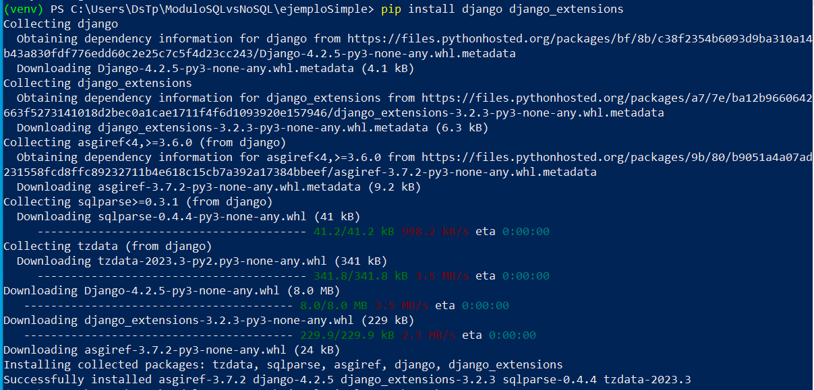
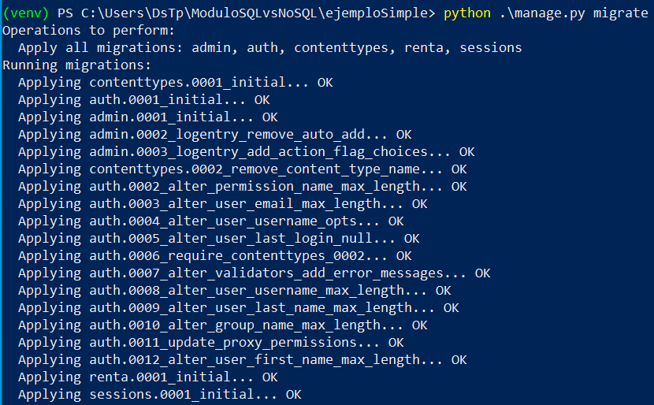
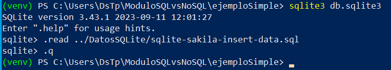
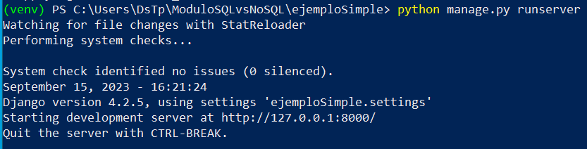
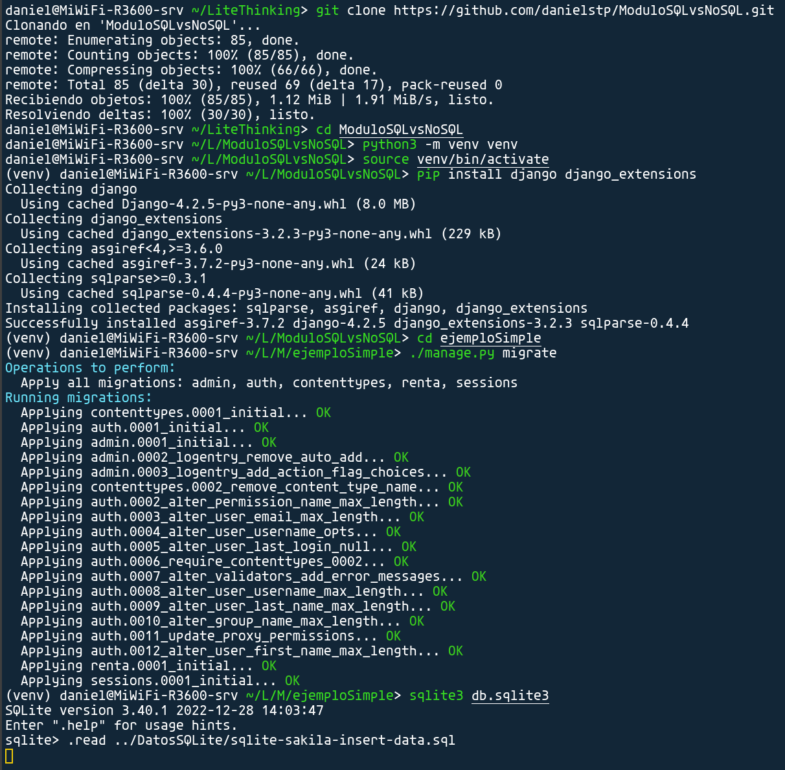
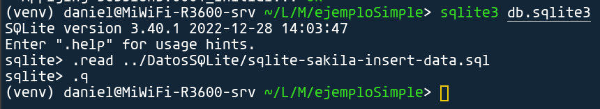
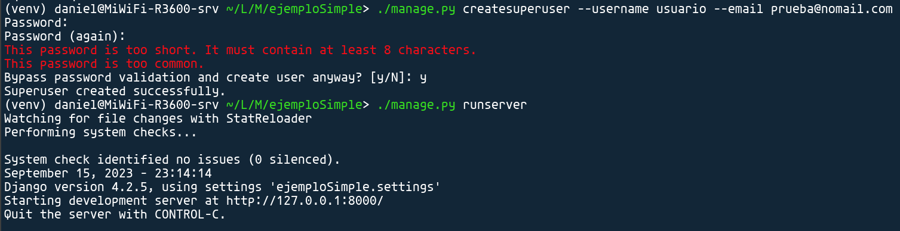
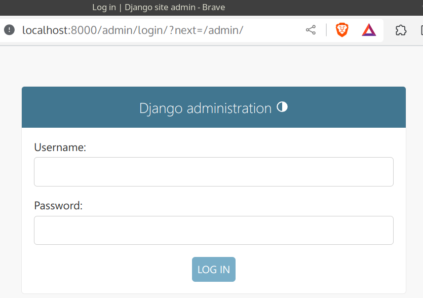

## Windows

```
git clone https://github.com/danielstp/ModuloSQLvsNoSQL.git
cd ModuloSQLvsNoSQL

python -m venv venv
.\venv\Scripts\activate

pip install django django_extensions
```


```
cd ejemploSimple

python manage.py migrate
```



```
sqlite3 db.sqlite3

.read ../DatosSQLite/sqlite-sakila-insert-data.sql

.q

```

```

python manage.py createsuperuser --username ${NombreDeUsuario} --email ${correo@gmail.com}

python manage.py runserver

```



## Linux o macOS

```
git clone https://github.com/danielstp/ModuloSQLvsNoSQL.git
cd ModuloSQLvsNoSQL
python3 -m venv venv
source venv/bin/activate

pip install django django_extensions

cd ejemploSimple

./manage.py migrate

sqlite3 db.sqlite3

.read ../DatosSQLite/sqlite-sakila-insert-data.sql

.q

```



```
./manage.py createsuperuser --username ${NombreDeUsuario} --email ${correo@gmail.com}

./manage.py runserver
```


## En un navegador

Acceder al http://localhost:8000/admin

