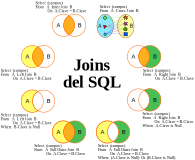

# ModuloSQLvsNoSQL
Curso de SQL y NoSQL

## Instalar SQLite

### Windows

[Instalar en Windows](Docs/InstalarEnWindows.md)

### Linux

#### Debian y derivados

[Instalar en Linux](Docs/InstalarEnLinux.md)

# Cargar datos iniciales en SQLite

[Cargar datos Iniciales en SQLite](Docs/CargarDatosInicialesEnSQLite.md)

# Prueba en Django

[Prueba de los datos en Django](Docs/PruebaDjango.md)

# Sentencia Join en SQL

[Sentencia Join en SQL](https://es.wikipedia.org/wiki/Sentencia_JOIN_en_SQL)

# Glosario

- [Glosario de términos en SQL](Docs/GlosarioSQL.md)

- [Glosario de términos en NoSQL](Docs/GlosarioNoSQL.md)

# Retos

0. [Reto 0](Docs/Reto0.md)