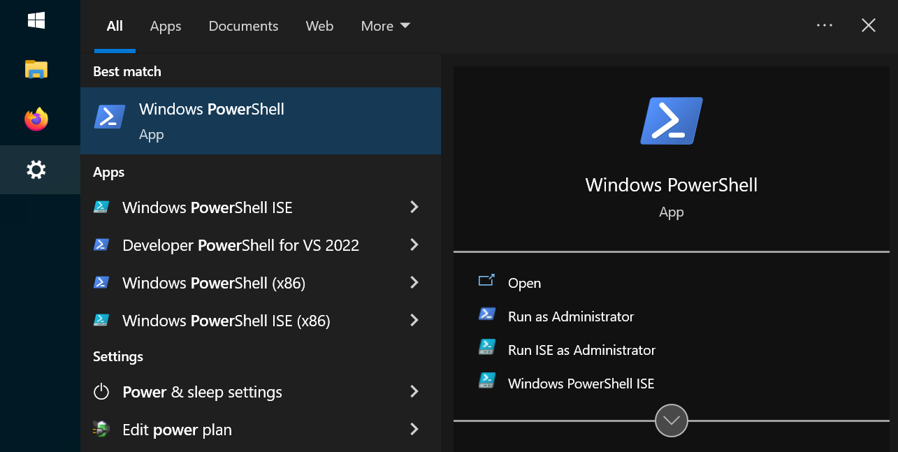
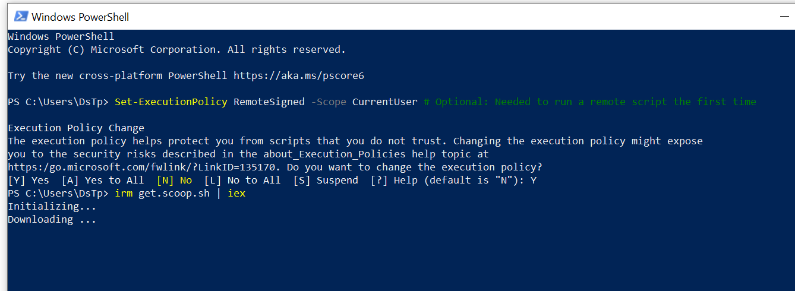
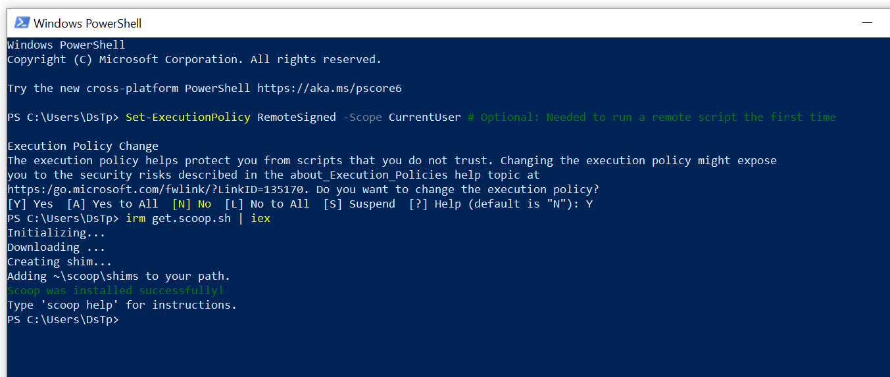

# ModuloSQLvsNoSQL
Curso de SQL y NoSQL


## Instalar SQLite

### Windows

En una ventana de PowerShell ejecutar:

```sh
Set-ExecutionPolicy RemoteSigned -Scope CurrentUser # Optional: Needed to run a remote script the first time
irm get.scoop.sh | iex

```
Set-ExecutionPolicy RemoteSigned -Scope CurrentUser # Optional: Needed to run a remote script the first time
irm get.scoop.sh | iex





Final mente en la misma ventana ejecutar:

```sh
scoop install main/sqlite
scoop install main/git

mkdir EjemplosSQL
cd EjemplosSQL

git clone https://github.com/danielstp/ModuloSQLvsNoSQL.git
cd ModuloSQLvsNoSQL


```